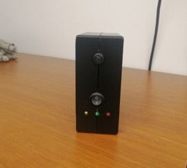

# 🧠 AI Coach

**AI Coach** is a real-time AI-powered fitness assistant that runs entirely on the edge using an NVIDIA **Jetson Nano** and camera. It uses **TRTpose** for lightweight pose estimation and deep learning models for exercise recognition and feedback — without needing internet or cloud processing.

---

## 📸 Device Overview

<!-- Alternative with size control -->
<!--  -->

---

## 📌 Project Overview

- **Goal:** Provide **real-time posture analysis and coaching** using video-based human pose estimation.
- **Platform:** Jetson Nano + camera
- **Pose Detection:** [TRTpose](https://github.com/NVIDIA-AI-IOT/trt_pose)
- **Application Domains:** Home fitness, rehabilitation, posture correction, senior health monitoring

---

## ⚙️ Key Features

- 🎯 Real-time pose estimation using **TRTpose**
- 🧠 On-device activity classification (e.g., squat, plank, push-up)
- 🔊 Audio/visual feedback loop (e.g., form correction alerts)
- 💾 Optional: Local logging for review or trainer feedback
- ⚡ Runs fully offline on Jetson Nano

---

## 🗂️ Project Structure

